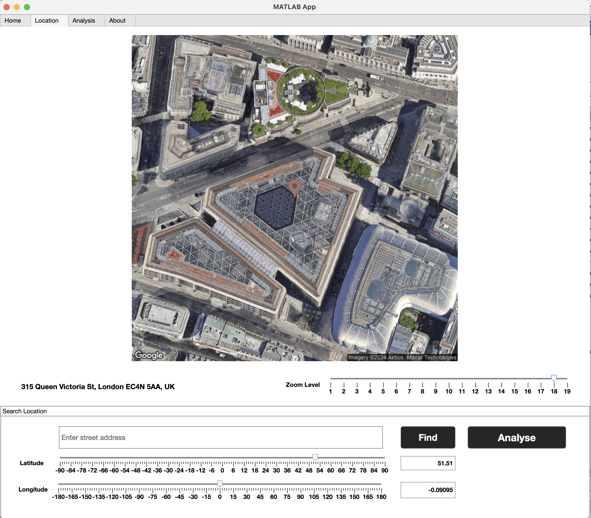
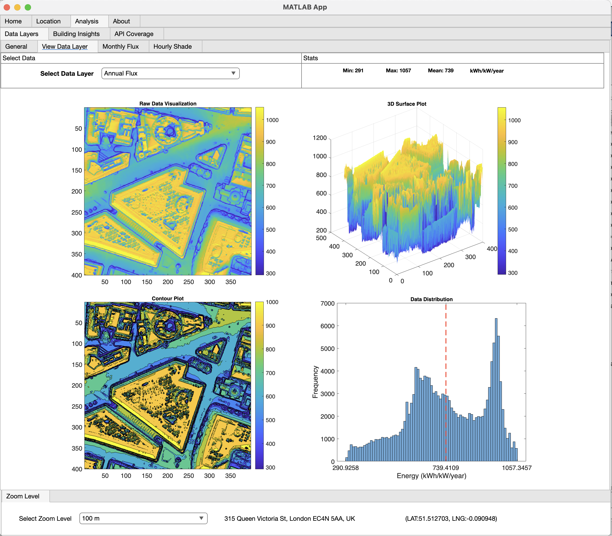
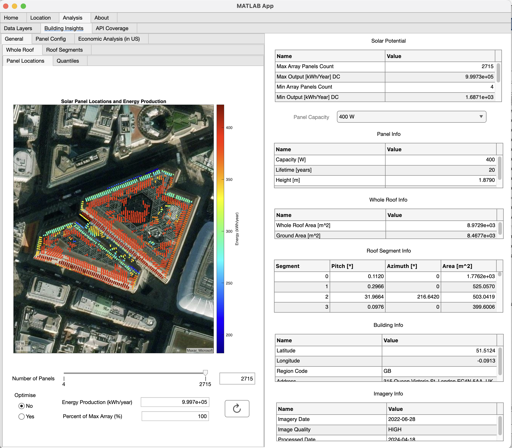

# PV PRO

**PV PRO** is a MATLAB app for exploring the _Google Maps Solar API_. It can be used to design rooftop PV systems and analyze their performance. It can access the Google Maps Solar API to get solar data for a given location. Google Maps API key is required to use the app.

## Google Maps Solar API

The Solar API1 is part of Google Maps Platform.

According to Google, the Solar API covers more than 472 million buildings in over 40 countries, which is not an insignificant number2. To be more specific, the API covers 472 million roofs all over the world.

The API accepts requests for three endpoints:

- **buildingInsights**: This service endpoint returns insights about the location, dimensions, and solar potential of a building.
- **dataLayers**: This service endpoint returns URLs for raw solar information datasets for an area surrounding a location.
- **geoTiff**: This endpoint fetches rasters with encoded solar information, including a digital surface model, an aerial image, annual and monthly flux
  maps, and hourly shade.

The imagery quality can be HIGH, MEDIUM, or LOW:

- **HIGH**: Solar data is based on high-resolution (e.g., 10cm) DSM data, typically from low-altitude aerial imagery.
- **MEDIUM**: Solar data is based on medium-resolution (e.g., 25cm) DSM data, typically from high-altitude aerial imagery.
- **LOW**: Solar data is based on low-resolution (e.g., 30 cm or worse) DSM data, typically from satellite imagery.

## Details

The application can be used to design building-integrated PV systems (BIPV), or in this case PV arrays on rooftops.

In the **Location** tab the user can select a location either by searching for a street address, or by entering latitude and longitude information. If the API
covers the searched location, the results are presented in the **Analysis** tab. The results show both **Data Layers** images and also **Building Insights** data.

The **Data Layers** tab presents detailed information about e.g. annual flux, monthly flux, hourly shade and DSM (digital surface model).

The **Building Insights** tab presents e.g. rooftop information, solar panel and array location information, roof segment information with tables and graphs that show
relevant statistics and parameters. The user can select and optimise a correctly sized PV array based on output data. The application does not currently cover
the economic analysis that is available for locations in the US.

## Usage

A walkthrough of the UI is presented [here](https://youtu.be/wjwdsyG0Hx0).

## Next version

More features will be added in the next version:

- Improve the UI (especially the location search and selection).
- Add economic analysis for locations, especially if the service becomes available outside the US.
- Add more detailed analysis of the results, such as life cycle cost analysis.
- Add decision making tools.
- Add complementary information from other APIs (like PVGIS or OpenWeatherMap).

## License

All Rights Reserved (see acknowledgements below).

## Acknowledgements

The useful `get_google_map`3 was created by Val Schmidt and `deg2utm`4 was created by Rafael Palacios. If conflicts of interest arise, these functions will be replaced by built-in geoaxes functions.

1[Google Maps Solar API](https://developers.google.com/maps/documentation/solar)
2[Our Solar API now covers more rooftops worldwide](https://cloud.google.com/blog/products/maps-platform/our-solar-api-now-covers-more-rooftops-worldwide)
3[get_google_map](https://se.mathworks.com/matlabcentral/fileexchange/24113-get_google_map?s_tid=FX_rc1_behav)
4[deg2utm](https://se.mathworks.com/matlabcentral/fileexchange/10915-deg2utm)
